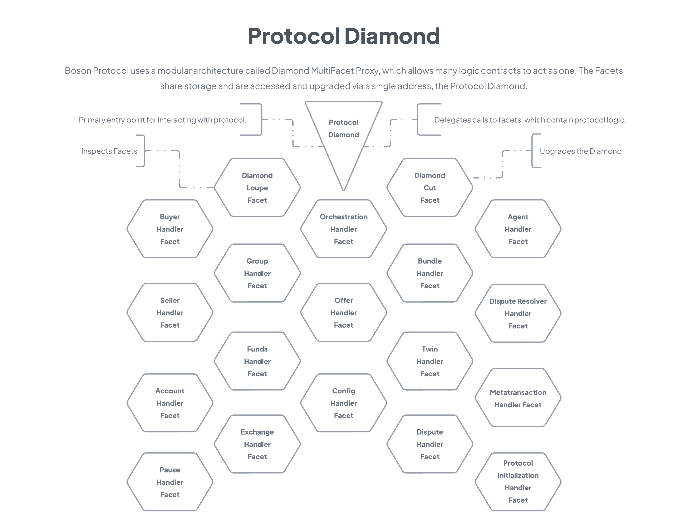
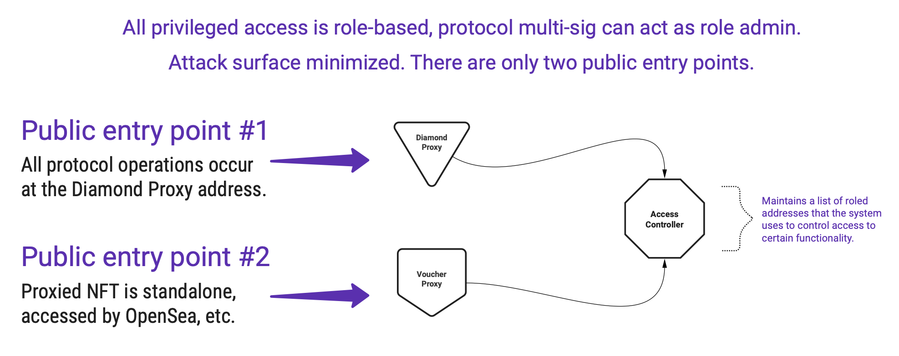

# Boson Protocol V2
## [Intro](../README.md) | [Setup](setup.md) | [Tasks](tasks.md) | Architecture | [Domain Model](domain.md)

## Contract Architecture
The V2 architecture takes a completely different approach versus V1. Considering new requirements and lessons learned, this version is geared to give us:
* **Upgradeability** - during our scaling phase, we must be able to refine and adapt the protocol to meet demand and changes in the greater ecosystem. Freedom to fix or improve any part of the protocol without disrupting service or requiring data migration is imperative.
* **Role-based access** to the privileged functions is important, so that increasingly decentralized control of upgrades can happen. Eventually full revocation of that control or transfer to the final, sustaining DAO is possible. "Exit to community" means the community gets to decide whether to throw away the keys.
* **Modularity** - simpler to reason about, test, and replace parts of. Once development begins and for as long as possible thereafter, we must be able to move fast, incorporate new functionality without disturbing the existing architecture or misplacing responsibilities.
* **Durability** - We need developer adoption for broad ecosystem penetration. Developers like project dependencies that don't burn down and rebuild so much. V3 is on the horizon, and as a living, engaged protocol, it must be able to adapt to the prevailing environment while minimizing friction to continued adoption.

### Protocol High Level Diagram

Our modular approach is based on [EIP-2939 Diamond MultiFacet Proxy](https://eips.ethereum.org/EIPS/eip-2535).

### Effective Attack Surface

### Protocol Diamond and Facets
The V2 protocol is built around the [EIP-2535](https://eips.ethereum.org/EIPS/eip-2535) Diamond Multi-Facet Proxy specification.

#### Diamond, you say?
If you aren't familiar with proxies or the Diamond in particular, a good analogy is a modular stereo system.
* **The Diamond** would be the amplifier, which manages the sound and video to and from a number of devices.
* **The Facets** would be DVD players, turntables, game consoles, TVs, speakers etc.

The analogy may not be exact, but the takeaways are that each facet is replaceable or removable independent of the others, and they are all controlled and monitored via the diamond.

#### Take a deeper dive on Diamonds
* [The reference implementation](https://github.com/mudgen/diamond-2-hardhat) we used is optimized for gas at transaction time. Ours implementation been adapted to use role-based access control rather than single-owner. It also manages supported interfaces for facets to avoid conflicts and allow testing of all our facets interfaces via [EIP-165](https://eips.ethereum.org/EIPS/eip-165).
* Nick Mudge, the architect of the Diamond specification, [has a blog](https://eip2535diamonds.substack.com/p/list-of-projects-using-eip-2535-diamonds) devoted to working with  Diamonds, along with a list of projects currently using the spec.

#### Reduces the protocol to a black box
The major components identified in the Boson Protocol Core Exchange Mechanism requirements are represented or covered by modules we deploy behind the Protocol Diamond proxy. Those modules are called Facets in EIP-2535 lingo.

All in-protocol operations will be performed at the Protocol Diamond address. The Diamond will delegate incoming calls to the appropriate logic contract.

As a developer on the outside, the protocol is reduced to a black box. You can invoke functions on it but you don't care about the relationships between different contracts. Different interfaces will expose different available functionality, so you might use one interface to ask it to create an offer, and another to commit to that offer. But it's the same box; the same ethereum address. 

#### Why is this is the right architecture for Boson Protocol?
This pattern gives us some distinct advantages, a few of which are:
- **Modular architecture**: Functionality is directly mapped to the broad areas of concern identified in the requirements. Also, it is easy to both illustrate and comprehend in a high level diagram.
- **Reduced the attack surface**: There are only two publicly accessible entry points.
- **Simple to monitor**: Only two addresses to watch for events.
- **Upgradeable**: Logic and storage are separated, such that any vulnerabilities can be properly remediated, not worked around. Fixing or improving the deployed code doesn't necessitate a messy migration of data (which sometimes is impossible if a strategy is not in place before the inital launch of a protocol).
- **Virtually unlimited contract size**: Any number of facets (logic) can easily be added or split behind the Diamond without spreading the attack surface.
- **Maintainability**: Developers can focus on business logic rather than managing contract collaboration patterns and the potential threats that naturally arise.
- **Easier to reason about contract storage**: When using Diamonds storage is a first class consideration. With developers working on different facets, it leads us to consider and declare the data that is maintained and visible to each facet in a uniform way. This means facets can share data while not clobbering each other in the shared storage slots of the Diamond proxy.

### Voucher NFT
Given the utility of the Diamond discussed above, you may have questions:

* Why is the VoucherNFT not just another facet? 
* Why have it be a standalone contract with it's own 1-to-1 proxy for upgradeability?

There are two reasons for this. Or really, one implacable reason and one follow-on justification:

#### Incompatible inherited code
Because of the way OpenZeppelin has currently implemented their upgradeable contracts, they are not safe to use behind a Diamond. 

The issue is that they define some storage members [directly in the contract](https://github.com/OpenZeppelin/openzeppelin-contracts-upgradeable/blob/master/contracts/token/ERC1155/ERC1155Upgradeable.sol#L24) rather than specifying a non-conflicting, designated storage slot. 

That would be fine if it were deployed in a 1-to-1 proxy relationship, because only another version of the same contract would access the data in the proxy storage after an upgrade. 

However, as a facet of a Diamond the same assumption is not true. If more than one facet does this, updates to storage data will collide and be corrupted in an unpredictable way. This is because one such contract is not aware of the members another has declared, but they both map to the same zero-based, incrementing storage slots rather than a designated slot.

#### Easier integration with marketplaces
Vouchers will be traded on marketplaces, who expect to integrate with relatively standard, occasionally proxied NFT contracts. Should problems arise with voucher tokens, it will be much easier to analyse the simple, proxied NFT than the full protocol.