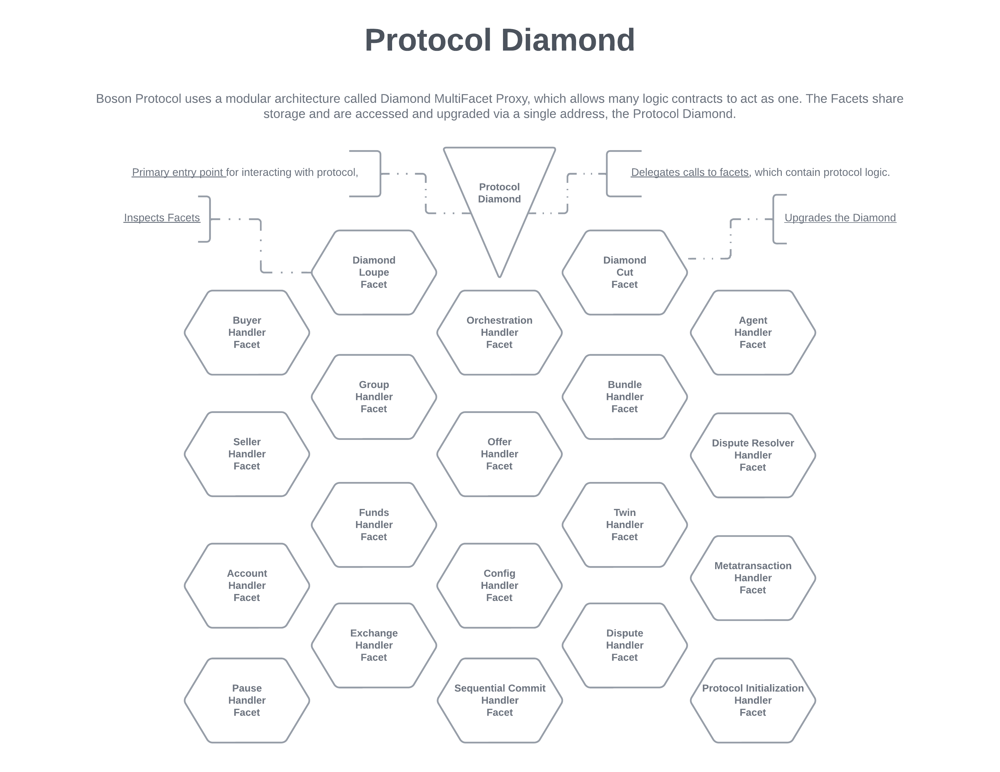
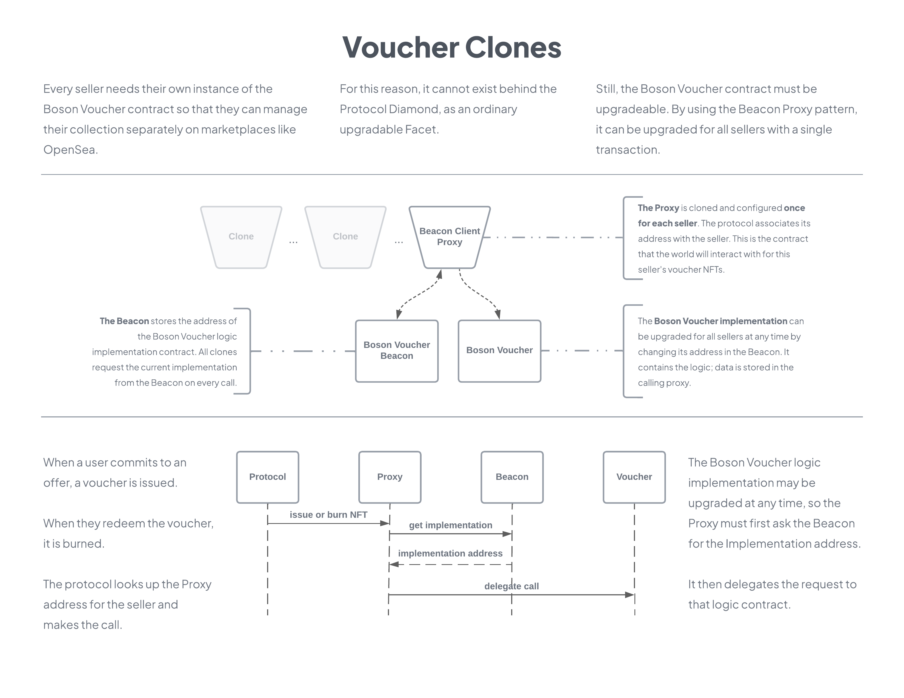
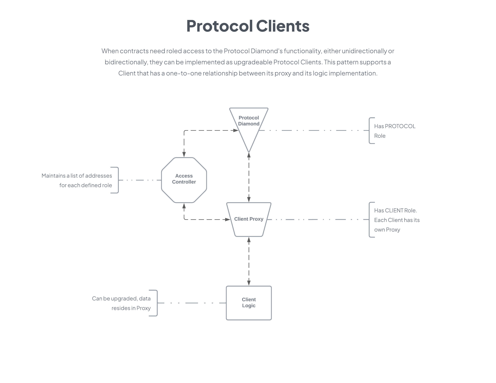

<h1 align="center">Boson Protocol V2</h1>

## [Intro](../README.md) | [Setup](setup.md) | [Tasks](tasks.md) | [Local development](local-development.md) | Architecture | [Domain Model](domain.md) | [State Machines](state-machines.md)

## Contract Architecture
The V2 architecture takes a completely different approach versus V1. Considering new requirements and lessons learned, this version is geared to give us:
* **Upgradeability** - during our scaling phase, we must be able to refine and adapt the protocol to meet demand and changes in the greater ecosystem. Freedom to fix or improve any part of the protocol without disrupting service or requiring data migration is imperative.
* **Role-based access** to the privileged functions is important, so that increasingly decentralized control of upgrades can happen. Eventually full revocation of that control or transfer to the final, sustaining DAO is possible. "Exit to community" means the community gets to decide whether and when to throw away the keys.
* **Modularity** - simpler to reason about, test, and replace parts of. Once development begins and for as long as possible thereafter, we must be able to move fast, incorporate new functionality without disturbing the existing architecture or misplacing responsibilities.
* **Durability** - We need developer adoption for broad ecosystem penetration. Developers like project dependencies that don't burn down and rebuild so often. V3 is on the horizon, and as a living, engaged protocol, it must be able to adapt to the prevailing environment while minimizing friction to continued adoption.

### Protocol Diamond and Facets

Our modular approach is based on [EIP-2535 Diamond MultiFacet Proxy](https://eips.ethereum.org/EIPS/eip-2535).

#### Diamond, you say?
If you aren't familiar with proxies or the diamond in particular, a good analogy is a modular stereo system.
* **The Diamond** would be the amplifier, which manages the sound and video to and from a number of devices.
* **The Facets** would be DVD players, turntables, game consoles, TVs, speakers etc.

The analogy may not be exact, but the takeaways are that each facet is replaceable or removable independent of the others, and they are all controlled and monitored via the diamond.

#### Take a deeper dive on Diamonds
* [The reference implementation](https://github.com/mudgen/diamond-2-hardhat) we used is optimized for gas at transaction time. Our implementation been adapted to use role-based access control rather than single-owner. It also manages supported interfaces for facets to avoid conflicts and allow testing of all our facet interfaces via [EIP-165](https://eips.ethereum.org/EIPS/eip-165).
* Nick Mudge, the architect of the Diamond MultiFacet Proxy specification, [has a blog](https://eip2535diamonds.substack.com/p/list-of-projects-using-eip-2535-diamonds) devoted to working with diamonds, along with a list of projects currently using the spec.

#### Reduces the protocol to a black box
The major components identified in the Boson Protocol Core Exchange Mechanism requirements are represented or covered by modules we deploy behind the Protocol Diamond proxy. Those modules are called Facets in EIP-2535 lingo.

All in-protocol operations will be performed at the Protocol Diamond address. The Protocol Diamond will delegate incoming calls to the appropriate logic contract.

As a client developer, the protocol is reduced to a black box. You can invoke functions on it but you don't care about the relationships between different contracts. Different interfaces will expose different available functionality, so you might use one interface to ask it to create an offer, and another to commit to that offer. But it's the same box; the same ethereum address.

#### Why is this is the right architecture for Boson Protocol?
This pattern gives us some distinct advantages, a few of which are:
- **Modular architecture**: Functionality is directly mapped to the broad areas of concern identified in the requirements. Also, it is easy to both illustrate and comprehend in a high level diagram.
- **Reduced the attack surface**: There is only one publicly accessible entry point to the protocol.
- **Simple to monitor**: Only one address to watch for protocol events.
- **Upgradeable**: Logic and storage are separated, such that any vulnerabilities can be properly remediated, not worked around. Fixing or improving the deployed code doesn't necessitate a messy migration of data (which sometimes is impossible if a strategy is not in place before the initial launch of a protocol).
- **Virtually unlimited contract size**: No need to worry about the diamond reaching the contract size limit, as all its functionality is delegated. Individual facets must fit within than the maximum contract size limit, of course. But when a facet must be split for size, implementing a strategy for privileged communication between its resultant pieces is not necessary as they merely contribute functions to the diamond.
- **Maintainability**: Developers can focus on business logic rather than managing contract collaboration patterns and the potential threats that naturally arise.
- **Easier to reason about contract storage**: When using Diamonds storage is a first class consideration. With developers working on different facets, it leads us to consider and declare the data that is maintained and visible to each facet in a uniform way. This means facets can share data while not clobbering each other in the shared storage slots of the diamond proxy.

### Voucher NFT

The Boson Voucher implementation is built around the OpenZeppelin [Beacon](https://docs.openzeppelin.com/contracts/4.x/api/proxy#beacon) and [ERC721](https://docs.openzeppelin.com/contracts/4.x/api/token/erc721) contracts.

Every seller needs their own instance of the Boson Voucher NFT so that they can manage their collection separately on marketplaces like OpenSea. For this reason, it cannot exist behind the Protocol Diamond, as an ordinary upgradable Facet.

Still, the Boson Voucher contract must be upgradeable. By using the Beacon Proxy pattern, it can be upgraded for all sellers with a single transaction.

### Protocol Clients

When contracts need roled access to the Protocol Diamond's functionality, either uni- or bi-directionally, they can be implemented as upgradeable Protocol Clients. This pattern supports a Client that has a one-to-one relationship between its proxy and its logic implementation.

Initially, the Boson Voucher NFT was implemented as an upgradable standalone contract with a one-to-one relationship to its proxy. When the requirement for sellers to have their own voucher collections came to pass, we switched to the Beacon pattern as described above. The pattern for roled, upgradeable standalone client support remains intact if not used at the moment.
