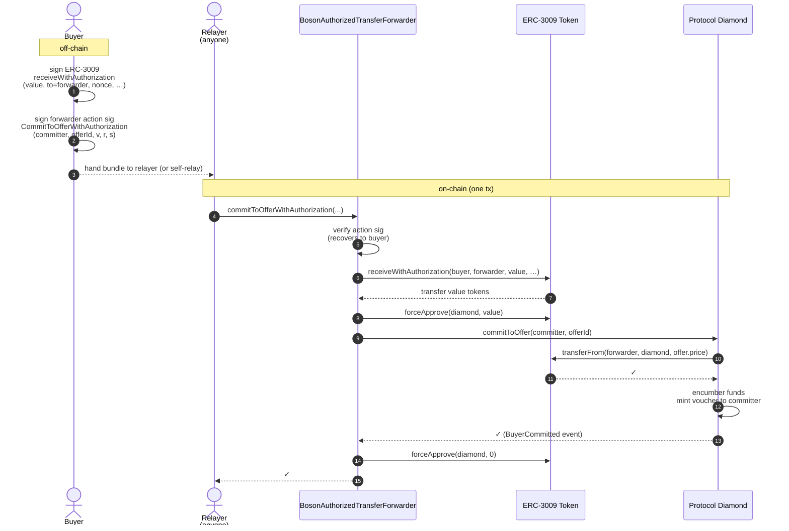
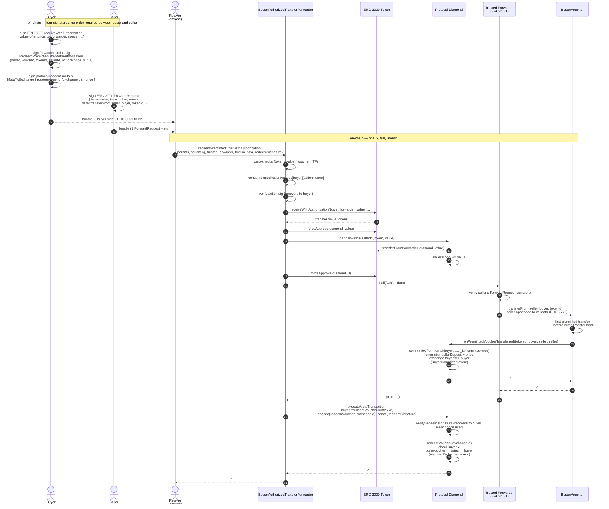

[](https://bosonprotocol.io)

<h1 align="center">Boson Protocol V2</h1>

### [Intro](../README.md) | [Audits](audits.md) | [Setup](setup.md) | [Tasks](tasks.md) | [Architecture](architecture.md) | [Domain Model](domain.md) | [State Machines](state-machines.md) | [Sequences](sequences.md)

# `BosonAuthorizedTransferForwarder`

A stateless companion client that lets a token holder execute a Boson
protocol call in a single transaction by signing an off-chain
authorisation — no separate `approve` tx required, and (for the
single-tx commit + redeem flow) no on-chain setup at all on the buyer
side.

- **Contract**: [`contracts/protocol/clients/BosonAuthorizedTransferForwarder.sol`](../contracts/protocol/clients/BosonAuthorizedTransferForwarder.sol)
- **Tests**: [`test/protocol/clients/BosonAuthorizedTransferForwarderTest.js`](../test/protocol/clients/BosonAuthorizedTransferForwarderTest.js)
- **Deploy script**: [`scripts/deploy-authorized-transfer-forwarder.js`](../scripts/deploy-authorized-transfer-forwarder.js) — `npx hardhat deploy-authorized-transfer-forwarder --network <net> --env <env>` reads the existing `addresses/<chainId>-<network>-<env>.json` for the protocol diamond and appends the new forwarder entry.

The forwarder is bound at construction to one protocol diamond
(`address public immutable protocol`). It is not payable and is not a
fund custodian — every call pulls tokens, deposits/transfers them
through the protocol, and exits with zero token balance and zero
allowance.

## Quick reference

| Entry point | Inner authorisation | What the protocol call does |
|---|---|---|
| [`depositFundsWithAuthorization`](#depositfundswithauthorization) | ERC-3009 `receiveWithAuthorization` | `IBosonFundsHandler.depositFunds(entityId, token, value)` |
| [`commitToOfferWithAuthorization`](#committoofferwithauthorization) | ERC-3009 `receiveWithAuthorization` | `IBosonExchangeCommitHandler.commitToOffer(committer, offerId)` |
| [`depositFundsWithPermit`](#depositfundswithpermit) | EIP-2612 `permit` | `IBosonFundsHandler.depositFunds(entityId, token, value)` |
| [`commitToOfferWithPermit`](#committoofferwithpermit) | EIP-2612 `permit` | `IBosonExchangeCommitHandler.commitToOffer(committer, offerId)` |
| [`redeemPremintedOfferWithAuthorization`](#redeempremintedofferwithauthorization) | ERC-3009 `receiveWithAuthorization` | voucher transfer (commits buyer) + `redeemVoucher(exchangeId)` via meta-tx |

`commitToBuyerOffer` is intentionally not supported: the protocol
identifies the seller via `_msgSender()` for that flow, which would
require this forwarder to be registered as each seller's assistant —
not viable for a generic per-deployment courier.

Native-currency offers/deposits are out of scope. The forwarder is not
payable.

## Common building blocks

### Per-call shape

Every entry point follows the same skeleton:

1. **Cheap input validation** (zero token/value/voucher/forwarder addresses).
2. **Replay protection** — for the permit and preminted-redeem flows, a one-shot `actionNonce` is consumed in `usedActionNonces[signer][nonce]` (same shape as the protocol's `MetaTransactionsHandler.usedNonce`). The ERC-3009 `*WithAuthorization` flows skip this because ERC-3009's own one-shot bytes32 nonce gives equivalent protection.
3. **Action signature verification** — an EIP-712 signature, under the forwarder's own domain (`name = "BosonAuthorizedTransferForwarder"`, `version = "1"`, chainId, `verifyingContract = forwarder`), recovered via `ECDSA.tryRecover`. Reverts with `InvalidActionSignature`.
4. **Pull tokens from the user.**
5. **`forceApprove(protocol, value); call protocol; forceApprove(protocol, 0)`** — exact-allowance pattern with defensive zero-out.

### Action signatures

The action signature exists to bind the user's *intent* (which
protocol call, which target) to the inner authorisation (ERC-3009 or
permit). Without it, an observer could pull the inner sig out of the
mempool and re-route the funds (different `entityId`, different
`committer`, different `offerId`).

The forwarder uses **two binding strategies**:

- **For ERC-3009 flows** the action typehash embeds the inner sig's
  `(v, r, s)`. Those bytes are the signature over the full ERC-3009
  message (token domain, value, validAfter, validBefore, nonce), so
  binding to them implicitly commits to all of those fields.
  `receiveWithAuthorization` is atomic — if any field mismatches, the
  whole tx reverts before any token movement. Replay protection comes
  from the ERC-3009 nonce.

- **For permit flows** the inner sig's `(v, r, s)` is *not* sufficient
  on its own, because `permit()` is wrapped in `try/catch` for
  front-runner DoS resilience. A failed inner permit falls back to
  whatever standing allowance the user has, so an old action sig
  could otherwise be paired with a new permit's allowance. The
  permit action typehashes therefore bind the protocol-call params
  (`token`, `value`, `deadline`) explicitly, and an on-chain one-shot
  `actionNonce` (in `usedActionNonces[signer][nonce]`) prevents
  replay of any single action sig.

Cross-chain replay is prevented on every signature in this contract
via chainId-bound EIP-712 domains.

Action sigs are ECDSA-only. Smart-contract wallets (ERC-1271) are not
supported — this matches ERC-3009 itself, which the spec defines for
EOAs only.

### Allowance hygiene

`_approveAndCall` always zero-resets the forwarder→protocol allowance
after the protocol call. The protocol normally pulls exactly `value`
so the allowance is already 0 and the second `forceApprove(0)` is a
warm no-op SSTORE; the unconditional reset keeps the path trivially
auditable.

---

## `depositFundsWithAuthorization`

Deposit ERC-20 funds into a Boson account (seller, buyer, agent, etc.)
in one tx, with the depositor signing only an off-chain ERC-3009
authorisation.

**Action typehash**

```
DepositFundsWithAuthorization(uint256 entityId, uint8 v, bytes32 r, bytes32 s)
```

**Flow**

1. Verify the action sig over the typehash above (recovers to `from`).
2. `IERC3009(token).receiveWithAuthorization(from, this, value, validAfter, validBefore, nonce, v, r, s)` — pulls `value` tokens from `from` to the forwarder.
3. `forceApprove(protocol, value)` → `IBosonFundsHandler.depositFunds(entityId, token, value)` → `forceApprove(protocol, 0)`. Protocol credits `entityId`'s pool with `value`.

**Notes**

- The token must implement ERC-3009 with EIP-712 domain
  `(name = "Foreign20WithAuthorization", version = "1")` for the
  in-repo mock, or whatever the production token uses (USDC, etc.).
- `entityId` can be a seller or buyer id — the protocol checks
  existence and reverts with `NoSuchEntity` if neither.
- The forwarder is the depositor of record (`FundsDeposited`'s
  `depositedBy` argument) but the funds are credited to `entityId`.

## `commitToOfferWithAuthorization`

Buy a Boson offer (commit) using ERC-20 funds in one tx.

**Action typehash**

```
CommitToOfferWithAuthorization(address committer, uint256 offerId, uint8 v, bytes32 r, bytes32 s)
```

**Flow**

1. Verify the action sig (recovers to `from`).
2. ERC-3009 pull as above.
3. `IBosonExchangeCommitHandler.commitToOffer(committer, offerId)` — protocol pulls `offer.price` from the forwarder, mints a voucher to `committer`. `committer` is signed into the action typehash so a third-party caller cannot redirect the voucher.

**Sequence**



**Notes**

- `committer` is a parameter and *can* differ from `from` (the buyer
  of record signs the ERC-3009 authorisation, but the voucher can
  mint to another address — both are bound by the action sig).
- The offer's exchange token must equal the ERC-3009 token; native-
  currency offers will revert (`NativeNotAllowed` from the protocol).

---

## `depositFundsWithPermit`

Same as `depositFundsWithAuthorization` but using EIP-2612 `permit`.

**Action typehash**

```
DepositFundsWithPermit(uint256 entityId, address token, uint256 value, uint256 deadline, uint256 actionNonce)
```

(Permit binds `token`/`value`/`deadline` explicitly because of
try/catch; see [Action signatures](#action-signatures).)

**Flow**

1. Zero-checks (token, value).
2. Consume `usedActionNonces[from][actionNonce]` (revert
   `ActionNonceAlreadyUsed` on replay).
3. Verify the action sig.
4. `try IERC20Permit(token).permit(from, this, value, deadline, v, r, s) {} catch {}` — tolerated to fail, e.g. when a front-runner has already consumed the permit nonce.
5. `IERC20(token).safeTransferFrom(from, this, value)` — succeeds against whatever allowance is in place; reverts with the standard ERC-20 error if none.
6. `forceApprove(protocol, value); depositFunds(entityId, token, value); forceApprove(protocol, 0)`.

**Notes**

- The `actionNonce` is chosen by the signer; any unused `uint256` is
  fine. The `MetaTransactionsHandler` `usedNonce` pattern is reused
  for symmetry.
- Because of the explicit binding, an attacker cannot splice an old
  action sig with a fresh permit to redirect funds to a different
  `token`/`value`/`deadline`/`entityId`.

## `commitToOfferWithPermit`

Same as `commitToOfferWithAuthorization` but using EIP-2612 `permit`.

**Action typehash**

```
CommitToOfferWithPermit(address committer, uint256 offerId, address token, uint256 value, uint256 deadline, uint256 actionNonce)
```

**Flow**: identical to `depositFundsWithPermit`'s steps 1–5, then
`commitToOffer(committer, offerId)` instead of `depositFunds`.

---

## `redeemPremintedOfferWithAuthorization`

Single-tx **buy + redeem** for preminted static-price offers. The buyer
pays once via ERC-3009, the seller's preminted voucher is transferred
straight to the buyer (committing the exchange in the same step), and
the buyer's signed redeem meta-tx burns the voucher and triggers any
twin-NFT transfers.

### Setup (per seller, one-time per voucher batch)

Standard preminted-offer prep, no new on-chain config:

1. Create the offer.
2. Reserve a range (`IBosonOfferHandler.reserveRange`).
3. `BosonVoucher.preMint(offerId, amount)`.
4. Deposit `sellerDeposit` per voucher into the protocol
   (`IBosonFundsHandler.depositFunds`).

The forwarder will top up the buyer's payment portion at runtime; the
seller deposit must already be in the seller's pool because the
commit-on-transfer hook encumbers `sellerDeposit + price`.

### Per-tx signatures

- **Buyer's ERC-3009 receive auth** for `value = offer.price`,
  `to = forwarder`, single-use bytes32 nonce.
- **Buyer's forwarder action sig** over the new typehash (binds the
  voucher routing and the inner sig):

  ```
  RedeemPremintedOfferWithAuthorization(
      address buyer,
      address voucher,
      uint256 tokenId,
      uint256 sellerId,
      uint256 actionNonce,
      uint8 v,
      bytes32 r,
      bytes32 s
  )
  ```

- **Buyer's protocol redeem meta-tx** — standard
  `MetaTransactionsHandler.executeMetaTransaction` for
  `redeemVoucher(uint256)`, signed under the protocol's EIP-712 domain
  with `META_TX_EXCHANGE_TYPEHASH`. `exchangeId = tokenId & ((1 << 128) - 1)` — known once the seller picks the voucher.
- **Seller's ERC-2771 ForwardRequest** for the trusted forwarder
  configured in `BosonVoucher`, with
  `data = transferFrom(seller, buyer, tokenId)`. The trusted
  forwarder's address is per-network — see
  [`scripts/config/client-upgrade.js`](../scripts/config/client-upgrade.js).
  This forwarder doesn't inspect or rewrite the calldata; it just
  relays it.

### Per-call flow



**Step-by-step recap of the on-chain side**

1. Cheap input validation (token / value / voucher / trustedForwarder addresses).
2. One-shot action nonce consumed in `usedActionNonces[buyer][actionNonce]`.
3. Action sig verified via `ECDSA.tryRecover` against the forwarder's EIP-712 domain.
4. ERC-3009 `receiveWithAuthorization` pulls the buyer's `value` to the forwarder. Atomic — any field mismatch reverts.
5. `forceApprove(diamond, value)` → `depositFunds(sellerId, token, value)` → `forceApprove(diamond, 0)`. Seller's pool now contains `sellerDeposit + price`.
6. Relay seller's signed `ForwardRequest` to the trusted forwarder. The trusted forwarder verifies the signature and calls `BosonVoucher.transferFrom(seller, buyer, tokenId)` with the seller appended via ERC-2771. The first transfer of a preminted voucher fires `onPremintedVoucherTransferred` → commits the buyer and encumbers the funds.
7. Relay buyer's signed redeem meta-tx via the protocol's `MetaTransactionsHandler`. `_msgSender()` resolves to the buyer; `checkBuyer` passes; voucher is burned; any twin NFTs are transferred to the buyer; `VoucherRedeemed` is emitted.

The forwarder does **not** perform a defensive `ownerOf(tokenId) == buyer` check between steps 6 and 7. It would be redundant: a misbehaving trusted forwarder that returns success without transferring leaves no `Committed` exchange (so step 7's `getValidExchange` reverts), and a seller who signs a transfer to a wrong recipient causes step 7's `checkBuyer` to revert with `NotVoucherHolder` (`exchange.buyerId` mismatches `params.buyer`'s buyer id). Skipping the post-condition also leaves room for legitimate smart-account flows that rely on `safeTransferFrom`'s `onERC721Received` hook to forward the voucher onward — the redeem still succeeds whenever `exchange.buyerId` ends up matching `params.buyer`.

### Why this is safe

- **Buyer can't be redirected.** The buyer's action sig binds
  `(buyer, voucher, tokenId, sellerId, actionNonce, v, r, s)`. Any
  mutation in the protocol-call params reverts
  `InvalidActionSignature`. The action nonce is one-shot.
- **Seller can't have their voucher redirected.** The seller's
  ForwardRequest is signed against the trusted forwarder's own EIP-712
  domain and includes the exact `transferFrom(seller, buyer, tokenId)`
  calldata. Any tampering — or any attempt to relay an old request
  whose nonce has been consumed — is rejected by the trusted forwarder.
- **The trusted forwarder is not blindly trusted.** A pathological
  forwarder that returns `(true, …)` without actually transferring
  leaves no committed exchange, so the redeem step's
  `getValidExchange(exchangeId, Committed)` reverts and the whole tx
  is rolled back.
- **Funds atomicity.** If anything in steps 4–8 reverts, the whole tx
  reverts — the buyer's tokens, the voucher, and the redeem are all
  rolled back together. The forwarder never holds a partial state.

### Notes & limitations

- **Static price only.** Price-discovery preminted offers take a
  different funds path (`isPriceDiscovery` branch in
  `FundsBase.encumberFunds`) and are not covered.
- **Voucher-redeemable window.** `redeemVoucher` checks
  `block.timestamp >= voucherRedeemableFrom` for the offer; the call
  must happen within the redeemable window or it reverts
  `VoucherNotRedeemable`.
- **Twin NFTs are best-effort.** Per Boson protocol convention, if a
  twin transfer fails (e.g. consumes too much gas), the redeem still
  succeeds and the exchange is auto-disputed. See
  [`twin-transfer-limits.md`](twin-transfer-limits.md).
- **Action sig and redeem meta-tx nonces are independent.** The action
  sig nonce lives in this forwarder; the redeem meta-tx nonce lives in
  the protocol's `MetaTransactionsHandler.usedNonce[buyer][...]`.
  Burning either one does not consume the other.

## Errors

| Error | Cause |
|---|---|
| `InvalidProtocolAddress` | constructor called with `address(0)` |
| `InvalidTokenAddress` | `token == address(0)` in any entry point |
| `ZeroValue` | `value == 0` in any entry point |
| `InvalidActionSignature` | action sig does not recover to the expected signer |
| `ActionNonceAlreadyUsed` | permit / preminted-redeem flow: `actionNonce` already consumed for this signer |
| `InvalidVoucherAddress` | `voucher == address(0)` (preminted-redeem flow) |
| `InvalidTrustedForwarderAddress` | `trustedForwarder == address(0)` (preminted-redeem flow) |

Reverts from the protocol diamond, the token, and the trusted
forwarder are bubbled verbatim — for example
`ERC20: insufficient allowance` from a permit DoS scenario or
`MockForwarder: signature does not match request` from a tampered
ForwardRequest.
