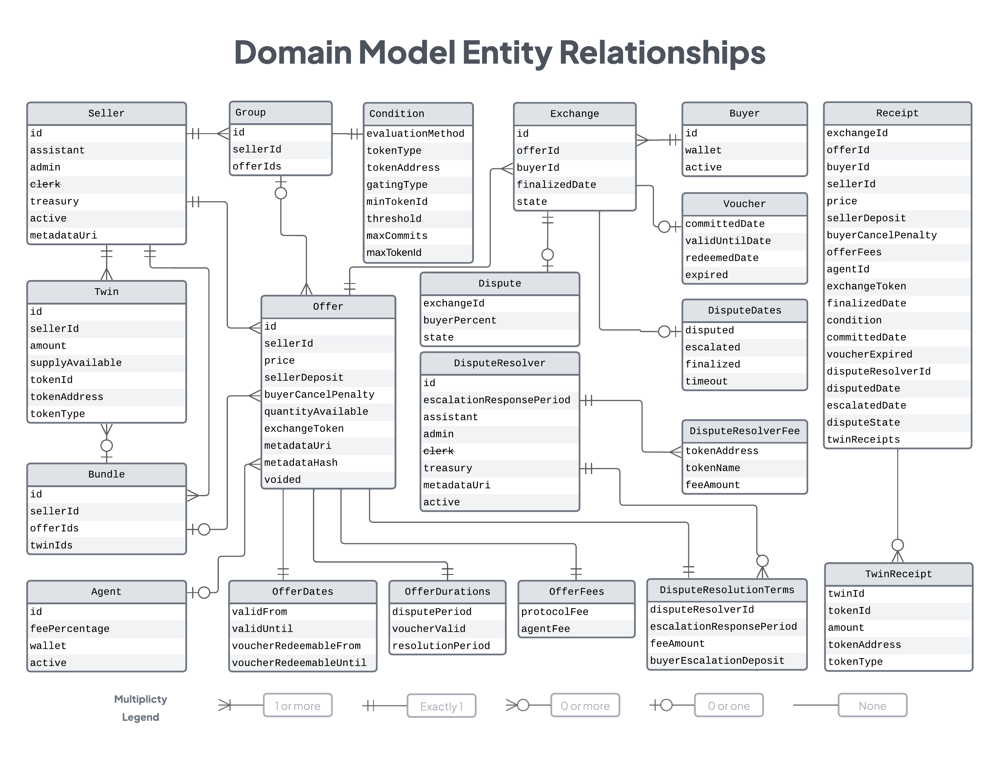

<h1 align="center">Boson Protocol V2</h1>

### [Intro](../README.md) | [Audits](audits.md) | [Setup](setup.md) | [Tasks](tasks.md) | [Architecture](architecture.md) | Domain Model | [State Machines](state-machines.md) | [Happy Path Exchange](happy-path-exchange.md)

## Entity Relationship Diagram

### Status and intentions of this model
* This date stamped diagram reflects the team's _current consensus_ about the protocol's domain entities and their relationships. 
* The state of the code may be behind or at odds with this diagram; we are _working toward this_ now. 
* Modifications to this domain model should be agreed upon by the team and this diagram updated before building if at possible.
* If confused, _assume this diagram the source of truth_, not the code.