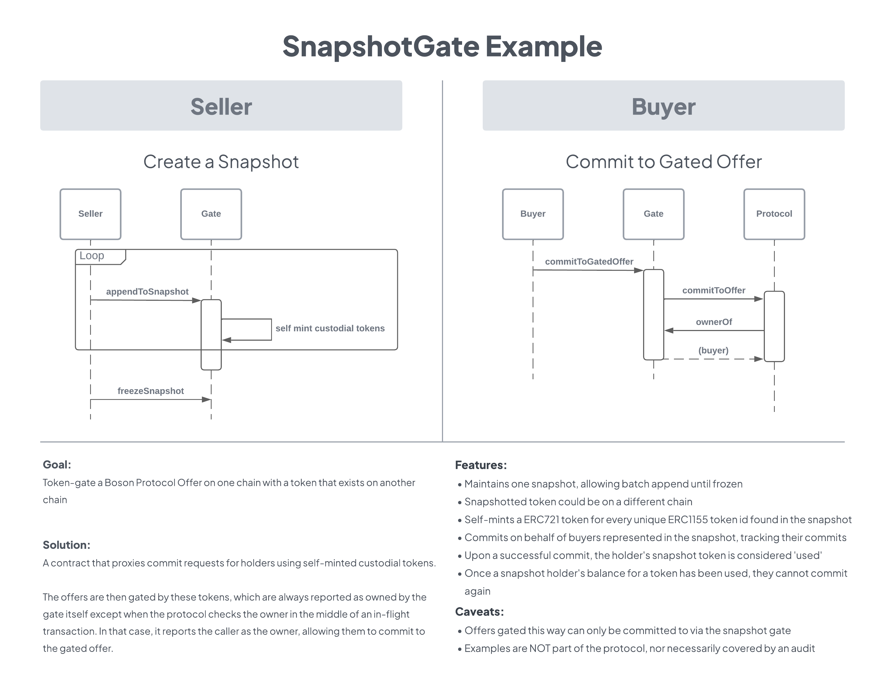

<h1 align="center">Boson Protocol V2</h1>

### [Intro](../../README.md) | [Audits](../audits.md) | [Setup](../setup.md) | [Tasks](../tasks.md) | [Architecture](../architecture.md) | [Domain Model](../domain.md) | [State Machines](../state-machines.md) | [Sequences](../sequences.md)

## [Examples](../examples.md)
### Snapshot Gate Example
#### Goal
Token-gate a Boson Protocol Offer on one chain with a token that exists on another chain.

#### Example components
* [SnapshotGate contract](../../contracts/example/SnapshotGate/SnapshotGate.sol)
* [Deployment script](../../scripts/example/SnapshotGate/deploy-snapshot-gate.js)
* [Unit tests](../../test/example/SnapshotGateTest.js)

In this unit-tested reference implementation, we gate Boson Protocol Offers with a "snapshot" of ERC-1155 holders. 

The protocol itself is not modified in any way. Rather, a standalone `SnapshotGate` contract acts as an intermediary between the seller's offers on the protocol and the holders of the snapshotted token (as of the time of the snapshot).

#### Features
* Maintains a single snapshot, allowing batch append by contract owner until snapshot is frozen.
* Self-mints a custodial ERC-721 token for every unique ERC-1155 token id found in the snapshot.
* Once a snapshot is frozen, proxies buyer "commit to offer" protocol requests, tracking their commits.
* Upon a successful commit, the holder's snapshot token is considered "used".
* Once a snapshot holder's balance for a token has been used, they cannot commit to offers gated by that token id again.

#### Out-of-band Setup
* Interrogate an ERC-1155, possibly on another chain, noting each token, its holders, and their balances. Also add up the total supply of each token as a function of its holder balances.
* Call the `appendToSnapshot` function, uploading part of all of the snapshot as an array of `Holder` structs (see the contract for its definition).
  - Depending on the size of your snapshot, you may not be able to upload it all in a single transaction. 
* Once a snapshot has been fully uploaded via one or more calls to `appendToSnapshot`, call `freezeSnapshot`. Buyers will not be able to commit to offers via this gate until the snapshot is frozen.
* This contract will hold self-minted tokens (with ids corresponding to their ERC-1155 counterparts from the snapshot), which will be used to gate the offer.
* Create Offers to be gated on the protocol. 
* The `quantityAvailable` for an offer should match the total supply of its corresponding snapshot token. 
* Create Groups on the protocol which:
  - Wrap their corresponding offers
  - Have a Condition that:
    - Expects a specific token (ERC721).
    - Uses this contract address as the token address.
    - Uses the appropriate snapshot token id for the gated offer.
    - Has `maxCommits` setting that matches the supply of its corresponding snapshot token.

#### Creating a Snapshot
In the unit tests for the example, we manufacture the snapshot programmatically. Creating a script to do the inventory is beyond the scope of the example.

In practice, you would write a script to take inventory of all the ERC-1155 token ids (or a subset thereof), creating a list of current holders and their balances. You might get this from raw  historical blockchain event data, or an indexer service like The Graph or Moralis. ERC-1155 doesn't have an `ownerOf` method, or any other standard way of querying the balances, so it is difficult to get the information directly.

#### Caveats
_The SnapshotGate contract instance you deploy is the only way that buyers can commit to offers gated in this way. Attempts to commit to the offers directly on the protocol will revert._

