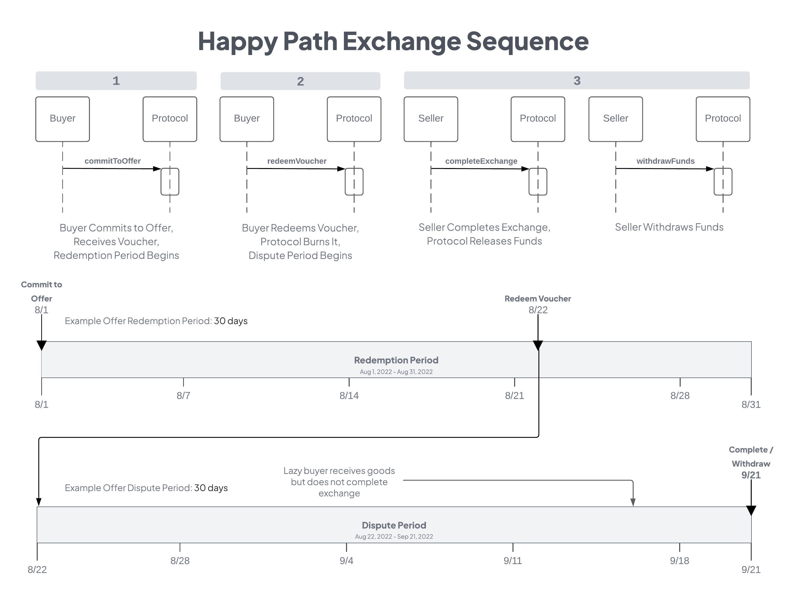

<h1 align="center">Boson Protocol V2</h1>

### [Intro](../README.md) | [Audits](audits.md) | [Setup](setup.md) | [Tasks](tasks.md) | [Architecture](architecture.md) | [Domain Model](domain.md) | [State Machines](state-machines.md) | Happy Path Exchange

## Happy Path Exchange

### About this diagram
* This diagram shows an example timeline and sequence of protocol interactions for the simplest possible instance of the so-called "Happy Path Exchange." 
* In the happy path scenario, no dispute is raised, and the voucher is never canceled or revoked, but rather redeemed sometime within the redemption period.
* The diagram shows the buyer committing to the offer, but in fact anyone can commit to the offer on behalf of the buyer. In any case, it is the buyer's wallet that must complete exchange-related transactions for buyer actions after redemption.
* "Lazy Buyer" describes the expected behavior of most buyers on the happy path. Once their order is fulfilled, no further interaction with the protocol is required on their part. In that case, the seller must wait until the fulfillment period has passed before they are able to complete the exchange and withdraw their funds.
* A kind buyer could, of course, complete the exchange any time during the fulfillment period, releasing the funds for the seller early. They would incur a network transaction fee (gas), and so they are not expected to take this action.
* It is also worth noting here that a seller does not have to withdraw their funds once an exchange is completed. They can leave it in the protocol to back their deposits for future exchanges, or only withdraw periodically.
