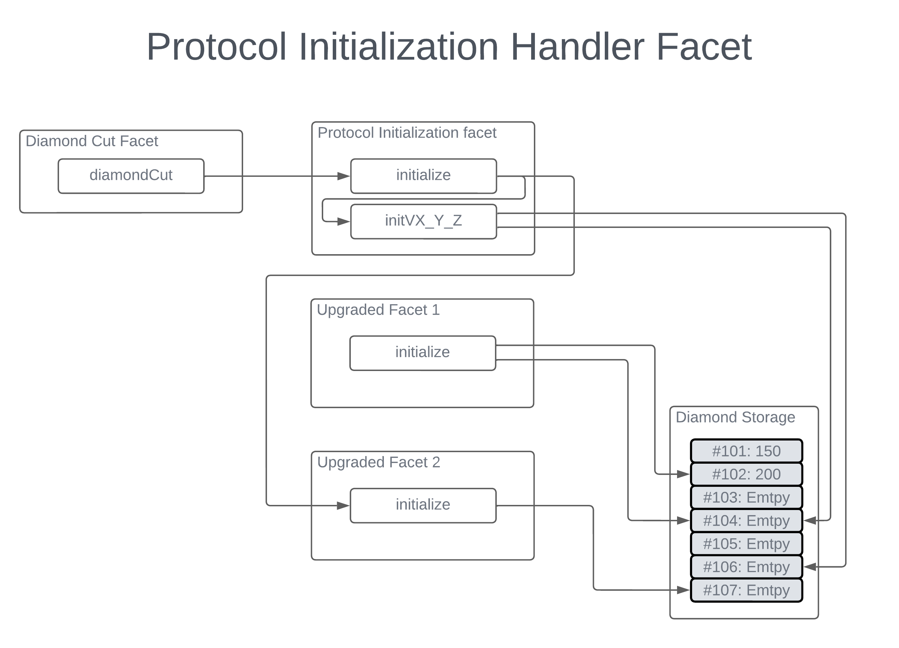

<h1 align="center">Boson Protocol V2</h1>

### [Intro](../README.md) | [Audits](audits.md) | [Setup](setup.md) | [Tasks](tasks.md) | [Architecture](architecture.md) | [Domain Model](domain.md) | [State Machines](state-machines.md) | [Sequences](sequences.md)

## Protocol initialization handler facet

The Protocol initialization handler facet plays a specialized role in the overall [architecture](architecture.md). On one side we have Diamond-specific facets - Loupe and Cut - which enable lookups and facet management. On the other hand we have Protocol specific facets which implement all the features needed for protocol to function as intended. Most of these facets need to be initialized at the time when cuts are performed, an example being the act of registering its own interface in the diamond. However, in some cases initialization of a facet is different depending on whether the whole protocol is deployed from scratch or whether it is being upgraded. Moreover, certain upgrades might introduce logic that requires data that was not produced in an older version of the protocol which also need to be handled in the initialization step. To this end, we introduce the Protocol initialization handler facet, which conceptually lives between the Diamond-specific and the Protocol-specific facets. Its role is to enable smooth atomic upgrades between versions. One of its functions is to backfill contract storage if needed for a given upgrade.

Protocol initialization handler facets responsibilities are to:
- store the version of the protocol,
- forward initialization calls to the appropriate facets,
- properly handle the initialization of data when called during an upgrade,
- remove supported interfaces,
- add supported interfaces.

Two biggest benefits of the Protocol initialization handler are:
- It allows for atomic cuts of multiple facets, this can at times alleviate the need to pause the protocol to perform an upgrade.
- It allows for custom storage manipulation, enabling the upgrades to backfill data as needed.

### Versioning

Initialize accepts version numbers that are encoded as bytes32. Every time an upgrade takes place, a unique version must be supplied, otherwise the initialization will revert. Checks can be performed against these version numbers, e.g. an upgrade to a given version can only be performed if the current protocol version is set to exactly one version below. This kind of restriction is planned to be used on every upgrade. This means that skipping versions during the upgrade will not be possible. If the latest version of protocol code is more than one version higher than currently deployed protocol, all intermediate upgrades need to be done to upgrade to the latest version.

Facets allows to query the current version by calling `getVersion`.

### Facet initialization

Each Protocol facet should have an initialization function (even if no-op) to ensure consistency across the codebase and the different versions. The initialization functions should be written as if the protocol is deployed for the first time (i.e. not taking into account potential effects on the upgrade). Although initialization functions must be external, they should not be part of facet interface and therefore should never be added to diamond function list. This is important to prevent facet reinitialization and clashes between initializers with same argument types.

When protocol is deployed for the first time, `initialize` on Protocol initialization handler should get a list of all facet implementation addresses together with corresponding initialization data. This data is passed directly on to individual facets where whole initialization takes place.  

However, before an upgrade is performed, the effects of facet initializers should be carefully considered before passing data to initialization handler. If a facet's initialization function does not affect the protocol state in a harmful way, it should be passed to initialization handler in the same way as for the initial deployment. However, when initialize affects the storage (for example Config handler sets all counters to 1), the facet should be omitted from the initialization call and the approach detailed in the next section should be followed.

### Data initialization

When facet initializers clash with existing data or if a specific bit of storage needs population, the initializer facet must be updated to cater for this kind of change. Suppose that in a new version X.Y.Z there is a need to modify the storage, a new function ought to be created, called `initVX_Y_Z`. This function can make additional version checks and can accept arbitrary data which can be handled in any desired way. This allows populating custom storage slots during the upgrade or mimicking actions of the facet initializers that would otherwise be harmful. For example if another limit is added to the Config handler, `initVX_Y_Z` could simply store new value to desired location, without the need to overwrite other config values and at the same time leaves counters intact.  
Initialization data is passed in as bytes, so `initVX_Y_Z` must be decoded into correct types as needed.

### Managing supported interfaces

Although most facets initializers automatically register their EIP165 interfaces, old interfaces are not automatically removed during upgrade/removal. Protocol initialization handler therefore allows upgrader to supply list of interfaces to remove or add, which happens atomically during the upgrade.

### Initialization diagram
The diagram represents a simple protocol upgrade whereby two facets are upgraded:
- Facet 1 has an initializer that writes to two slots, one of which is already populated.
- Facet 2 has an initializer that writes to an empty slot.

During the upgrade, the following happens:
- diamondCut is invoked externally. After it performs cut actions, it calls initialize on Protocol Initialization Facet.
- Since Facet 2 has upgrade-safe initializer, it is invoked directly on Facet itself.
- On the other hand, calling `initialize` on Facet 1 would affect already populated storage slot #102 and another empty slot #104. To avoid undesired effects, `initialize` cannot be called directly. Instead, `initVX_Y_Z` updates slot #104 and leaves #102 untouched.
- Additionally `initVX_Y_Z` also touches slot #106, not because some initializer would otherwise do it, but for example because some updated method from Facet 1 needs to read from that slot.

