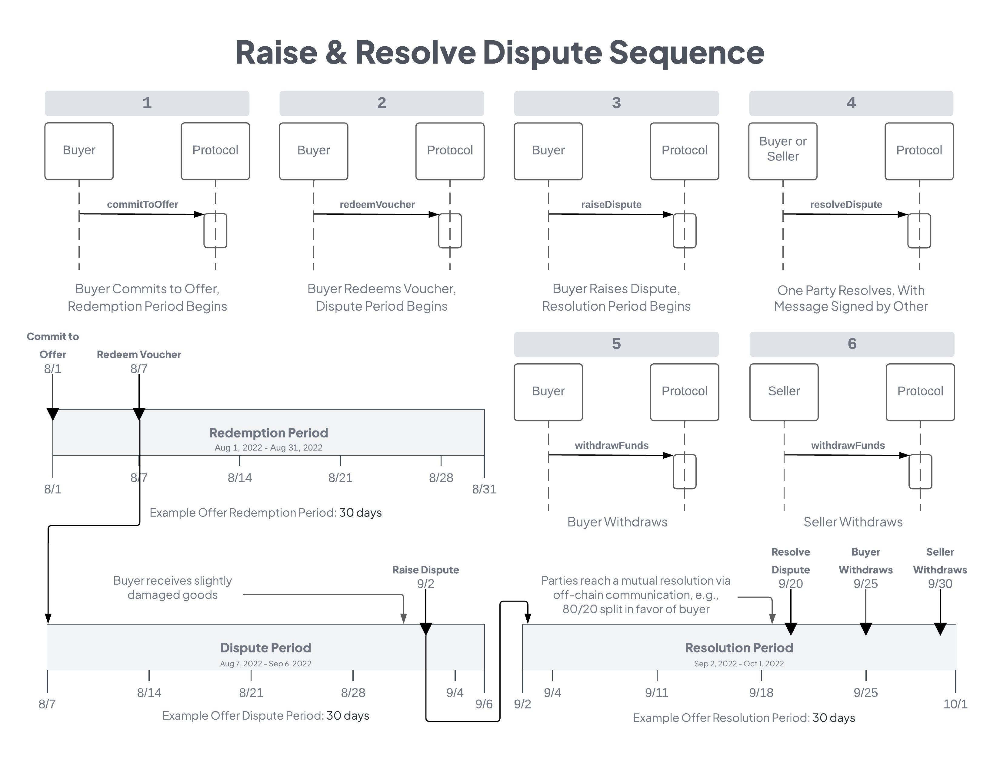

<h1 align="center">Boson Protocol V2</h1>

### [Intro](../README.md) | [Audits](audits.md) | [Setup](setup.md) | [Tasks](tasks.md) | [Architecture](architecture.md) | [Domain Model](domain.md) | [State Machines](state-machines.md) | Sequences

## Happy Path Exchange

### About this diagram
* This diagram shows an example timeline and sequence of protocol interactions for the simplest case of the so-called "Happy Path Exchange".
* In the Happy Path scenario, no dispute is raised, and the voucher is never canceled or revoked, but rather redeemed sometime within the redemption period.
* The diagram shows the buyer committing to the offer, but in fact anyone can commit to the offer on behalf of the buyer. In any case, it is the buyer's wallet that must complete exchange-related transactions for buyer actions after redemption.
* "Lazy Buyer" describes the expected behavior of most buyers on the happy path. Once their order is fulfilled, no further interaction with the protocol is required on their part. In that case, the seller must wait until the dispute period has passed before they are able to complete the exchange and withdraw their funds.
* A kind buyer could, of course, complete the exchange any time during the dispute period, releasing the funds for the seller early. They would incur a network transaction fee (gas), and so they are not expected to take this action.
* It is also worth noting here that a seller does not have to withdraw their funds once an exchange is completed. They can leave it in the protocol to back their deposits for future exchanges, or only withdraw periodically.

## Raise and Resolve a Dispute

### About this diagram
* This diagram shows an example timeline and sequence of protocol interactions for a dispute raised and mutually resolved by the buyer and seller.
* In this scenario, the buyer has received damaged or otherwise unacceptable goods. Since the Dispute Period has not yet elapsed, the buyer raises a dispute. In an off-chain discussion the two parties arrive at a resolution, expressed as the percentage of the pot (all committed funds from both parties for the current exchange) that the buyer will receive. 
* Also, as noted in the Happy Path sequence, neither party must necessarily withdraw their funds immediately nor in any particular order. Funds unencumbered at the end of an exchange accumulate for the buyer and seller, so they may withdraw all available funds from finalized exchanges at any time. The seller may leave it in the protocol to back their deposits for future exchanges.

## Escalate a Dispute

### About this diagram
* This diagram shows an example timeline and sequence of protocol interactions for a dispute raised, which fails to be mutually resolved by the buyer and seller. The buyer then escalates the dispute, to be decided by the offer's designated dispute resolver.
* At the time of escalation, the buyer must make a small deposit (a percentage of the dispute resolver fee) as a spam prevention measure. That deposit will be added to the pot (all committed funds from both parties for the current exchange) that will be split according to the dispute resolver's decision.
* In this scenario, the buyer has received damaged or otherwise unacceptable goods. Since the Dispute Period has not yet elapsed, the buyer raises a dispute. In an off-chain discussion, the two parties fail to arrive at a resolution, expressed as the percentage of the pot that the buyer will receive. The example in the diagram shows a 100% refund for the buyer being decided upon by the dispute resolver.
* Regardless of the resolution, neither party must withdraw funds immediately nor in any particular order. Funds unencumbered at the end of an exchange accumulate for the buyer and seller, so they may withdraw all available funds from finalized exchanges at any time. The seller may leave it in the protocol to back their deposits for future exchanges.
