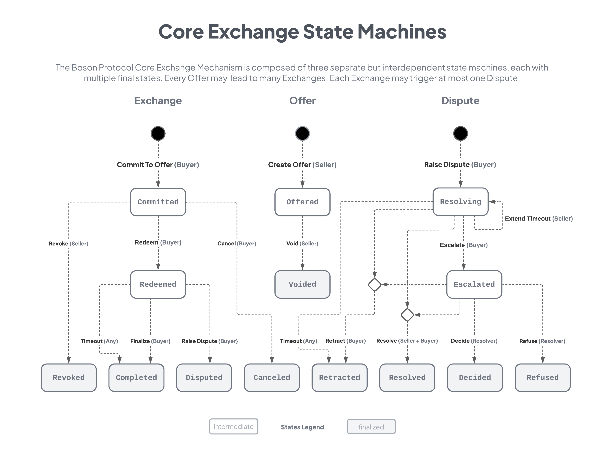

<h1 align="center">Boson Protocol V2</h1>

### [Intro](../README.md) | [Audits](audits.md) | [Setup](setup.md) | [Tasks](tasks.md) | [Architecture](architecture.md) | [Domain Model](domain.md) | State Machines | [Sequences](sequences.md)

## Core Exchange State Machines Diagram

### Status and intentions of this diagram
* This date stamped diagram reflects the team's _current consensus_ about the state machines making up the protocol's core exchange mechanism.
* The state of the code may be behind or at odds with this diagram; we are _working toward this_ now. 
* Modifications to this diagram should be agreed upon by the team and this diagram updated before building if at possible.
* If confused, _assume this diagram the source of truth_, not the code.